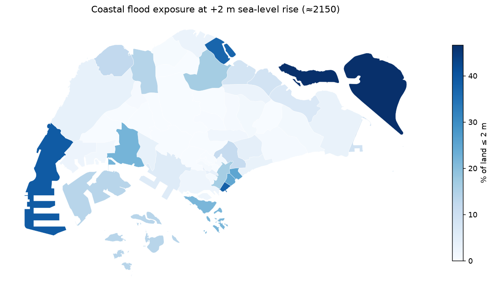
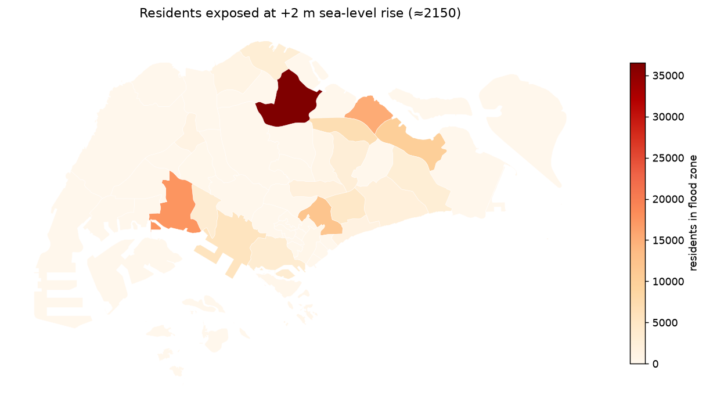
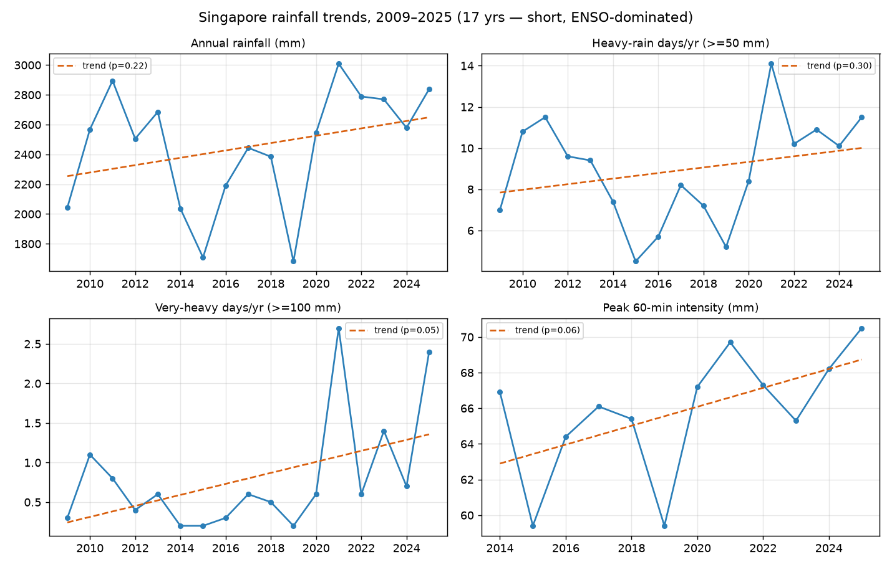
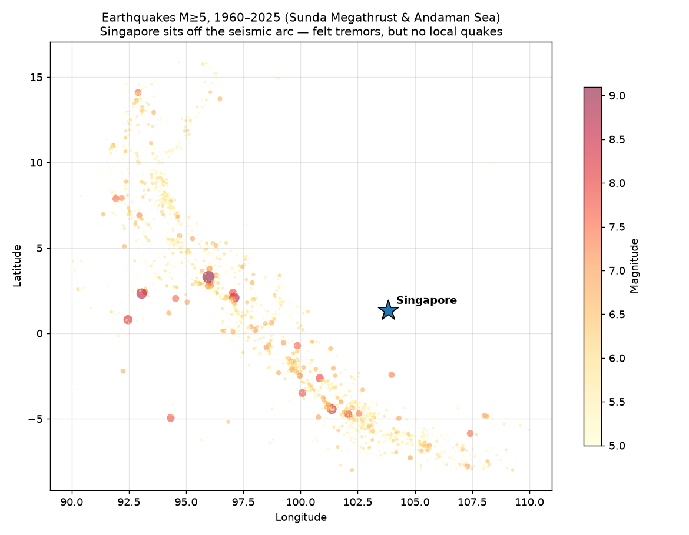

# Singapore Disaster Risk Mapping

A project aiming to find out environmental hazards that actually affect Singapore.
It is grounded in real, open data, and honest about which risks are present-day
versus low-probability risks.

**[Explore the interactive map here](https://MAMMOTHMAN34.github.io/sg-disaster-risk/)!**
Static results below.

## Why I built this

I recall seeing the claim that Singapore, which is long considered safe from natural disasters, might now face hazards that were "previously impossible," like earthquakes. As a
data science and economics student interested in the environment, I wanted to check
whether the data actually supported that.

It mostly didn't, and that turned out to be the interesting part:

- **Earthquakes aren't the story.** Singapore sits on the stable Sunda Block, not a
  plate boundary, so it doesn't generate its own earthquakes. It only *feels* distant
  tremors from the Sunda Megathrust off Sumatra, and climate change wouldn't change this.
- **The escalating climate-driven threat is the sea.** About 30% of Singapore is
  less than 5m above mean sea level. The government's [Third National Climate Change
  Study (2024)](https://www.nccs.gov.sg/singapores-climate-action/coastal-protection/)
  projects mean sea-level rise of up to **1.15m by 2100** and **~2m by 2150**, which
  combined with storm surge and high tide could push water levels to **4–5m**. In
  2019, the government committed [**S$100 billion or more**](https://www.straitstimes.com/singapore/environment/singapore-could-spend-100-billion-or-more-over-100-years-to-tackle-threat-of)
  over 50–100 years to coastal defence, and has since passed a Coastal Protection Bill
  and [launched the "Long Island" reclamation project](https://www.nccs.gov.sg/singapores-climate-action/coastal-protection/).
- **Flash flooding is the hazard already happening, and the rain is intensifying.**
  Since 2010, Singapore has seen recurring flash floods (e.g. the 2010 Orchard Road
  event) when intense tropical rainfall meets low-lying, heavily paved terrain. Singapore's [annual rainfall has risen ~83 mm per decade since 1980](https://www.nccs.gov.sg/singapores-climate-action/impact-of-climate-change-in-singapore/),
  and the Third National Climate Change Study projects **extreme rainfall increasing
  across all seasons** (by as much as 92% in the inter-monsoon months). Heavier
  downpours on the same paved, low-lying terrain, with rising seas straining coastal
  drainage, means the flood problem compounds.
- **Tsunami is a low-probability risk.** A [2024 NTU Earth Observatory
  study](https://mothership.sg/2024/07/singapore-tsunami-risk/) found that an undersea
  volcanic eruption in the Andaman Sea could send a tsunami to Singapore through the
  Malacca Strait.

Therefore, this project is really an exercise in **data literacy**. I aim to take popular but
slightly inaccurate (clickbaity) headlines and replace them with what the evidence supports: that
Singapore's defining environmental risk is actually **water** (rising sea levels + intense rainfall).

## What it does

Two flood hazards, treated with equal depth, plus a low-probability tail risk.

| Track | Hazard | What I do |
|-------|--------|-----------|
| **Coastal flooding** | Rising seas | Map which neighbourhoods flood as the sea rises, under Singapore's own official scenarios (+1m by 2100, +2m by 2150, ~4m with storm surge + high tide), built from elevation data |
| **Flash flooding** | Intense rain | Use 17 years of rain-gauge data (2009–2025) to map which areas get the most intense downpours, and test whether heavy rain is becoming more frequent |
| **Economic exposure** | Coastal | How many residents live inside the low-lying flood zones, set against the S$100 billion coastal-defence commitment |
| **Tail-risk context** | Tsunami / seismic | Sunda-shelf earthquake history + the 2024 tsunami study, shown as low-probability context (Singapore feels distant tremors but generates no quakes of its own) |
| **Dashboard** | All | One interactive map tying the layers together |

## Results

An interactive version of all layers (toggle coastal / flash / exposure /
earthquakes) is **[live here](https://MAMMOTHMAN34.github.io/sg-disaster-risk/)**.

### Coastal flooding (rising seas)

Using 2013 Copernicus elevation, under Singapore's official sea-level scenarios:

| Scenario | Land that floods | Residents exposed (today) |
|----------|------------------|---------------------------|
| +1m (≈2100) | ~10% | ~119,000 (2.9%) |
| +2m (≈2150) | ~11% | ~135,000 (3.3%) |
| +4m (worst case) | ~17% | ~238,000 (5.9%) |

The S$100 billion coastal-defence budget works out to roughly **S$740,000 per
exposed resident** at +2m. However, the most-flooded land (Tuas, Jurong Island) is
industrial with **~0 residents**, so *human* exposure (HDB towns: Yishun,
Punggol, Pasir Ris) and *economic* exposure (western reclamations) are two
different maps. Population data only sees the first.




### Flash flooding (intense rain)

A terrain-based flood score ranks Singapore's *actual* flash-flood hotspots
(Geylang, Bukit Timah) **low**. The key finding is that these floods are driven by
overwhelmed **drains**, not low ground. Over 2009–2025, every rainfall measure
trends upward, but 17 years is too short to be statistically conclusive; the
clearest signal is in the **most extreme** downpours (borderline significant),
matching the government's longer record.



### Tail-risk (tsunami / seismic)

4,031 earthquakes of M≥5 since 1960 in the region; the nearest M≥7 is **421 km**
away and the 2004 M9.1 was **897 km** away. Singapore sits off the seismic arc, thus
it feels distant tremors but generates no quakes of its own.



### Limitations & future work

What this analysis can't yet see, and where I'd take it next:

- **Elevation is a *surface* model** (includes buildings) and 2013 predates the
  newest reclamation (Tuas mega port), which still reads low.
    *Next:* a bare-earth LiDAR DEM would give true ground heights.
- **Flash flooding isn't really modelled.** The terrain index shows *why* (it's a
  drainage problem), but a real flash-flood model needs PUB's drainage-network
  and historical flood-incident data.
    *Next:* obtain those to model pluvial risk properly.
- **Exposure is residential only**. It assumes residents spread evenly within an
  area and excludes ~1.5 million non-resident workers, so it misses daytime/economic
  exposure in places like Tuas.
    *Next:* add a gridded population and land-value layer.
- **17 years is short for climate trends.** *Next:* fold in the downscaled NCCS
  V3 projections to extend the rainfall outlook.

## Key takeaways

- Singapore's defining environmental risk is **water**.
- **~135,000 residents** sit in the +2m sea-level-rise zone; coastal defence
  works out to roughly **S$740k per exposed resident**.
- **Human** flood exposure (HDB towns) and **economic** flood exposure (western
  industrial reclamations) are different maps, as population data alone misses the latter.
- Flash flooding is an **infrastructure** problem (drains).
- Earthquake/tsunami risk is real but **low-probability**, since Singapore sits off
  the seismic arc.

## Data sources

- **Rainfall (live)**: [data.gov.sg real-time API](https://data.gov.sg) (NEA rain gauges)
- **Rainfall (history + intensity)**: [weather.gov.sg daily archive](https://www.weather.gov.sg/climate-historical-daily/): per-station daily totals and 30/60/120-min bursts, 2009–2025
- **Elevation**: [Copernicus GLO-30 DEM](https://copernicus-dem-30m.s3.amazonaws.com/) (~2013, includes post-2000 reclamation; SRTM 2000 used earlier but superseded)
- **Planning-area boundaries**: data.gov.sg (URA Master Plan 2019)
- **Sea-level-rise scenarios**: NCCS Third National Climate Change Study (2024)
- **Seismic events**: USGS Earthquake API
- **Population**: data.gov.sg / SingStat (residents by planning area, for economic exposure)

## Stack

Python · pandas · GeoPandas · rasterio · SciPy · Matplotlib · Folium · requests

## Setup & pipeline

```bash
pip install -r requirements.txt

# 1. Collect raw data
python -m src.data.fetch_elevation_dem     # Copernicus elevation
python -m src.data.fetch_boundaries        # planning-area polygons
python -m src.data.fetch_rainfall_history  # 2009–2025 daily rainfall (~30 min)
python -m src.data.fetch_seismic           # regional earthquakes
python -m src.data.fetch_population         # residents per planning area

# 2. Build the layers
python -m src.features.inundation          # low-lying land per area
python -m src.features.slr_scenarios       # flooding at +1/+2/+4m
python -m src.features.rainfall_stats       # per-gauge rainfall climatology
python -m src.features.flood_index          # coastal/flash susceptibility
python -m src.features.rainfall_trend       # is heavy rain getting worse?
python -m src.features.economic_exposure    # residents in flood zones

# 3. Visualise
python -m src.viz.figures                  # static maps for this README
python -m src.viz.plot_seismic             # tail-risk figure
python -m src.viz.dashboard                # interactive docs/index.html
```